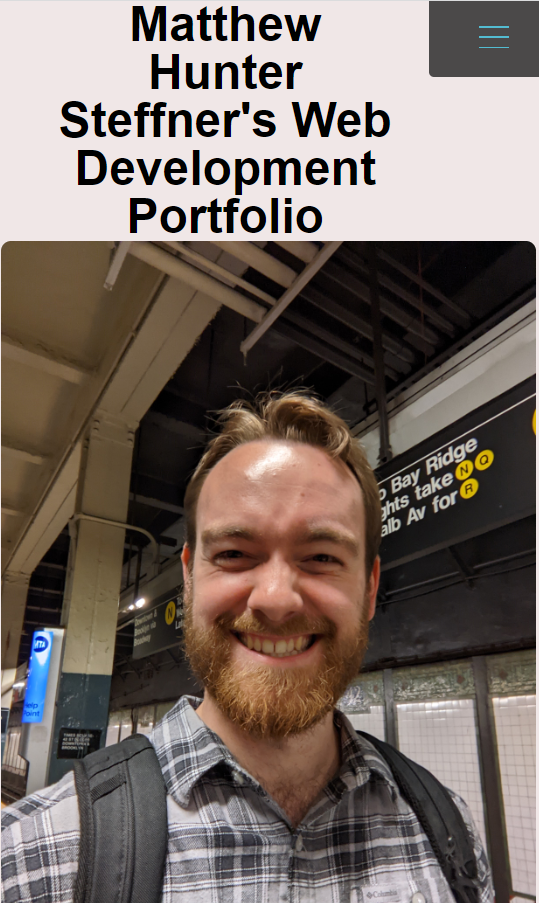
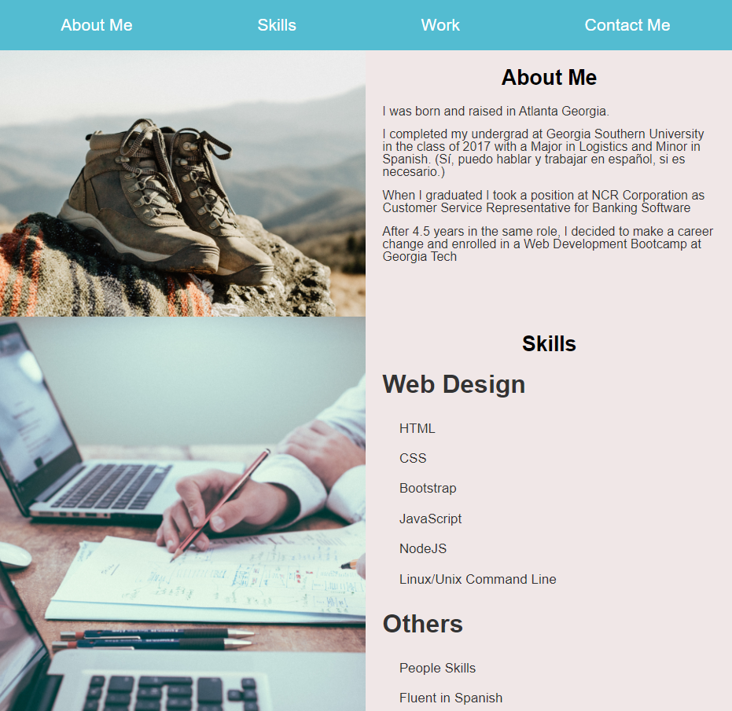

# Bootcamp Challenge 2: Portfolio

This is a challenge assignment done with Georgia Tech's Full Stack Bootcamp Program

## Purpose

This is meant to be a way for students to practice building a website to showcase their projects and best work.

## Deployed Site

```bash
https://huntersteffner.github.io/Challenge-02-portfolio/

```

## Mobile Screenshot



## Desktop Screenshot



## Contributing

This project can be cloned and referenced as inspiration in creating another portfolio webpage. Please only use as a reference.
